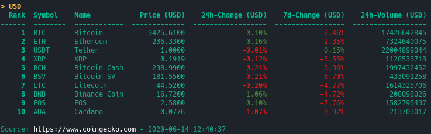

Logo attribution: [Snake](https://thenounproject.com/vishal.marotkar/uploads/?i=316335) by **V I S H A L** & [crypto currency](https://thenounproject.com/term/crypto-currency/1372103) by **Iconika** from the [Noun Project](https://thenounproject.com)

## Help
`$ python pyCoin.py -h`

## Showing the top10 crypto currencies
### Basic usage
```
$ python pyCoin.py
```


### Currencies
Available currencies:

**Fiats:**

USD, AUD, BRL, CAD, CHF, CLP, CNY, CZK, DKK, EUR, GBP, HKD, HUF, IDR, ILS, INR, JPY, KRW, MXN, MYR, NOK, NZD, PHP, PKR, PLN, RUB, SEK, SGD, THB, TRY, TWD, ZAR


**Cryptos:**

BTC, ETH, XRP, LTC, BCH

#### Using another currency
```
$ python pyCoin.py --curr EUR
```


#### Using multiple currencies
```
$ python pyCoin.py --curr USD,EUR
```


### Sorting
#### Rank (default)
Descending: `$ python pyCoin.py --sort rank`

Ascending: `$ python pyCoin.py --sort rank-`

#### Price
Descending: `$ python pyCoin.py --sort price`

Ascending: `$ python pyCoin.py --sort price-`

#### 24h-change
Descending: `$ python pyCoin.py --sort change_24h`

Ascending: `$ python pyCoin.py --sort change_24h-`

#### 7d-change
Descending: `$ python pyCoin.py --sort change_7d`

Ascending: `$ python pyCoin.py --sort change_7d-`

#### Volume
Descending: `$ python pyCoin.py --sort volume`

Ascending: `$ python pyCoin.py --sort volume-`


## Showing custom crypto currencies
```
$ python pyCoin.py --crypto BTC,DOGE,MIOTA,GRLC,VTC,LET,NANO
```

